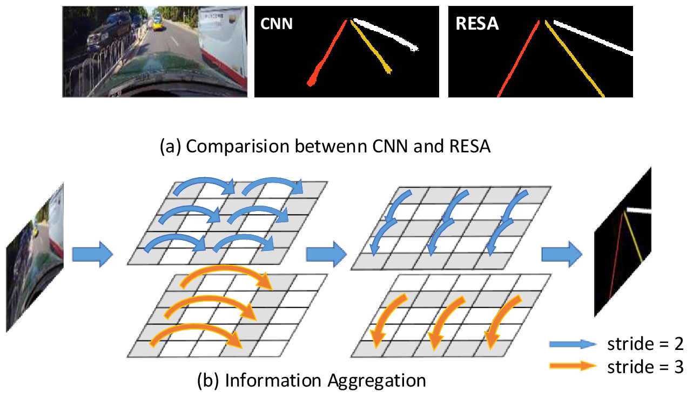

# RESA 
PyTorch implementation of the paper "[RESA: Recurrent Feature-Shift Aggregator for Lane Detection](https://arxiv.org/abs/2008.13719)".

Our paper has been accepted by AAAI2021.

**News**: We also release RESA on [LaneDet](https://github.com/Turoad/lanedet). It's also recommended for you to try LaneDet.

## Introduction

- RESA shifts sliced
feature map recurrently in vertical and horizontal directions
and enables each pixel to gather global information.
- RESA achieves SOTA results on CULane and Tusimple Dataset.

## Get started
1. Clone the RESA repository
    ```
    git clone https://github.com/zjulearning/resa.git
    ```
    We call this directory as `$RESA_ROOT`

2. Create a conda virtual environment and activate it (conda is optional)

    ```Shell
    conda create -n resa python=3.8 -y
    conda activate resa
    ```

3. Install dependencies

    ```Shell
    # Install pytorch firstly, the cudatoolkit version should be same in your system. (you can also use pip to install pytorch and torchvision)
    conda install pytorch torchvision cudatoolkit=10.1 -c pytorch

    # Or you can install via pip
    pip install torch torchvision

    # Install python packages
    pip install -r requirements.txt
    ```

4. Data preparation

    Download [CULane](https://xingangpan.github.io/projects/CULane.html) and [Tusimple](https://github.com/TuSimple/tusimple-benchmark/issues/3). Then extract them to `$CULANEROOT` and `$TUSIMPLEROOT`. Create link to `data` directory.
    
    ```Shell
    cd $RESA_ROOT
    mkdir -p data
    ln -s $CULANEROOT data/CULane
    ln -s $TUSIMPLEROOT data/tusimple
    ```

    For CULane, you should have structure like this:
    ```
    $CULANEROOT/driver_xx_xxframe    # data folders x6
    $CULANEROOT/laneseg_label_w16    # lane segmentation labels
    $CULANEROOT/list                 # data lists
    ```

    For Tusimple, you should have structure like this:
    ```
    $TUSIMPLEROOT/clips # data folders
    $TUSIMPLEROOT/lable_data_xxxx.json # label json file x4
    $TUSIMPLEROOT/test_tasks_0627.json # test tasks json file
    $TUSIMPLEROOT/test_label.json # test label json file

    ```

    For Tusimple, the segmentation annotation is not provided, hence we need to generate segmentation from the json annotation. 

    ```Shell
    python tools/generate_seg_tusimple.py --root $TUSIMPLEROOT
    # this will generate seg_label directory
    ```

5. Install CULane evaluation tools. 

    This tools requires OpenCV C++. Please follow [here](https://docs.opencv.org/master/d7/d9f/tutorial_linux_install.html) to install OpenCV C++.  Or just install opencv with command `sudo apt-get install libopencv-dev`

    
    Then compile the evaluation tool of CULane.
    ```Shell
    cd $RESA_ROOT/runner/evaluator/culane/lane_evaluation
    make
    cd -
    ```
    
    Note that, the default `opencv` version is 3. If you use opencv2, please modify the `OPENCV_VERSION := 3` to `OPENCV_VERSION := 2` in the `Makefile`.


## Training

For training, run

```Shell
python main.py [configs/path_to_your_config] --gpus [gpu_ids]
```


For example, run
```Shell
python main.py configs/culane.py --gpus 0 1 2 3
```

## Testing
For testing, run
```Shell
python main.py c[configs/path_to_your_config] --validate --load_from [path_to_your_model] [gpu_num]
```

For example, run
```Shell
python main.py configs/culane.py --validate --load_from culane_resnet50.pth --gpus 0 1 2 3

python main.py configs/tusimple.py --validate --load_from tusimple_resnet34.pth --gpus 0 1 2 3
```


We provide two trained ResNet models on CULane and Tusimple, downloading our best performed model (Tusimple: [GoogleDrive](https://drive.google.com/file/d/1M1xi82y0RoWUwYYG9LmZHXWSD2D60o0D/view?usp=sharing)/[BaiduDrive(code:s5ii)](https://pan.baidu.com/s/1CgJFrt9OHe-RUNooPpHRGA),
CULane: [GoogleDrive](https://drive.google.com/file/d/1pcqq9lpJ4ixJgFVFndlPe42VgVsjgn0Q/view?usp=sharing)/[BaiduDrive(code:rlwj)](https://pan.baidu.com/s/1ODKAZxpKrZIPXyaNnxcV3g)
)

## Visualization
Just add `--view`.

For example:
```Shell
python main.py configs/culane.py --validate --load_from culane_resnet50.pth --gpus 0 1 2 3 --view
```
You will get the result in the directory: `work_dirs/[DATASET]/xxx/vis`.

## Citation
If you use our method, please consider citing:
```BibTeX
@inproceedings{zheng2021resa,
  title={RESA: Recurrent Feature-Shift Aggregator for Lane Detection},
  author={Zheng, Tu and Fang, Hao and Zhang, Yi and Tang, Wenjian and Yang, Zheng and Liu, Haifeng and Cai, Deng},
  booktitle={Proceedings of the AAAI Conference on Artificial Intelligence},
  volume={35},
  number={4},
  pages={3547--3554},
  year={2021}
}
```

<!-- ## Thanks

The evaluation code is modified from [SCNN](https://github.com/XingangPan/SCNN) and [Tusimple Benchmark](https://github.com/TuSimple/tusimple-benchmark). -->
